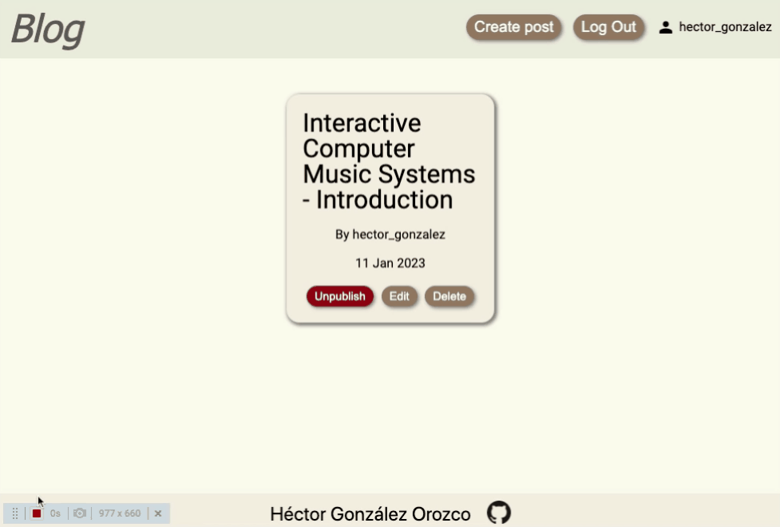

# Blog App 

Front end of blog [MERN](https://www.mongodb.com/mern-stack) stack application. Made with TypeScript using React and Redux.

I made this as a personal blog, to publish posts about web development and computer music.

Code for the Back end can be found [here](https://github.com/hectorgonzalezo/blog_server)

By [Héctor González Orozco](https://github.com/hectorgonzalezo)

## :computer: Built With

* [ReactJS](https://reactjs.org/)
* [Redux](https://redux.js.org/)

## :ferris_wheel: Live Preview

[https://blog-client-mern.netlify.app/](https://blog-client-mern.netlify.app/)

## :rocket: Features

- User sign up and log in.

- Two permission levels for users: regular and administrator. 

-  Administrators can add and edit posts. 

- Regular users can add and edit comments.

## :construction: Installing

1. Clone the repository

`git clone https://github.com/hectorgonzalezo/blog_client`

2. Install dependencies

`npm install`

3. Start the development server

`npm start`

Typescript code can be compiled by using the following command: 

`npm run build`

## :camera: Sneak Peek

